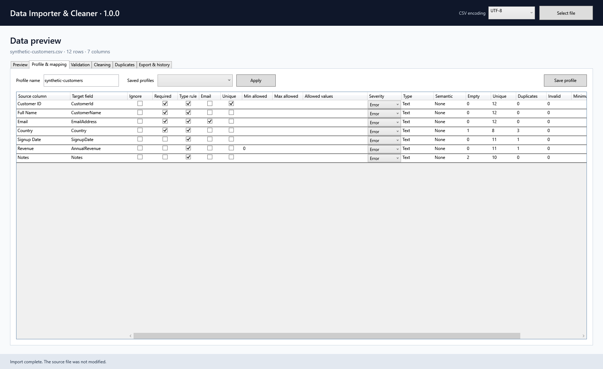
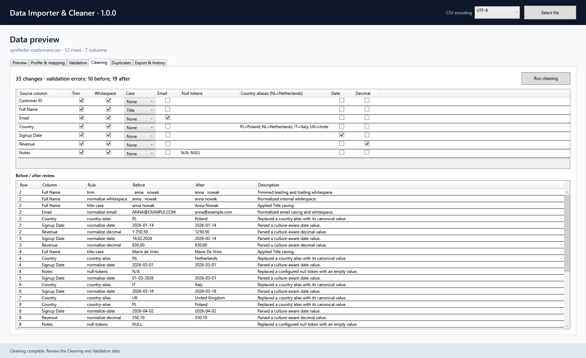
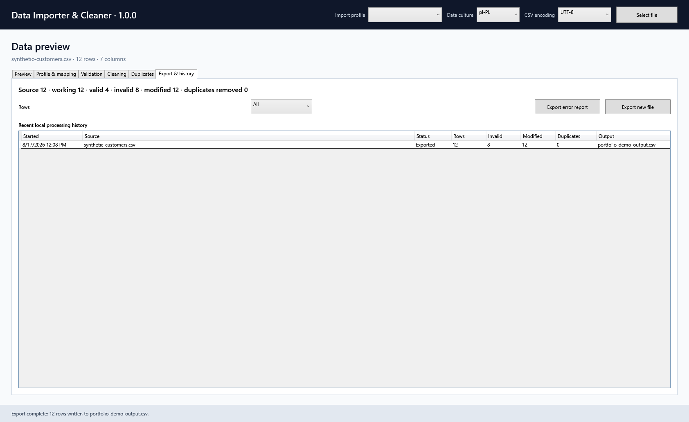

# Data Importer & Cleaner

Data Importer & Cleaner is a Windows desktop application for turning inconsistent CSV and Excel files into clean, validated and reusable business data through a safe, reviewable workflow.

> [!IMPORTANT]
> Version 1.0.1 is the current stable release. M1–M8 and the audit-hardening pass are complete, and the self-contained Windows package is available from [GitHub Releases](https://github.com/Staniek-Tech-NL/data-importer-cleaner/releases/tag/v1.0.1).

## Why this project exists

Business data often arrives with inconsistent headers, whitespace, date formats, decimal separators, country names, missing values and duplicates. Fixing these files manually is slow and difficult to audit. This project provides a deterministic desktop workflow that preserves the source data and makes every transformation reviewable before export.

The repository is also a portfolio case study in layered .NET desktop development, data processing, validation, persistence, automated testing and release engineering.

## Workflow

```text
Import → Preview → Profile → Map → Pre-validation → Clean
       → Post-validation → Deduplicate → Review → Export
```

Validation and cleaning remain separate. The validation engine can run before and after cleaning so that users can distinguish source problems from issues that remain in the final dataset.

## Product tour

### Data profiling and mapping



The profiling view combines inferred column statistics, validation settings and explicit source-to-target mappings in one reviewable step.

### Cleaning before and after



Every deterministic transformation is recorded with its row, column, rule, source value, resulting value and explanation.

### Import summary and export history



The final summary reports valid, invalid and modified rows and keeps a local record of the generated output without persisting imported row contents.

## Project status

| Area | Status | Target milestone |
| --- | --- | --- |
| Layered solution and WPF shell | Complete | M1 |
| Dependency injection and logging | Complete | M1 |
| SQLite model and initial migration | Complete | M1 |
| Domain foundations and processing contracts | Complete | M1 |
| CSV import and preview | Complete | M2 |
| XLSX import and worksheet selection | Complete | M2 |
| Data profiling and column mapping | Complete | M3 |
| Validation engine | Complete | M4 |
| Cleaning engine and before/after review | Complete | M5 |
| Deterministic duplicate detection | Complete | M6 |
| CSV/XLSX/SQLite export and history | Complete | M7 |
| Portfolio release | Complete | M8 |

See the [roadmap](docs/roadmap.md) and [project plan](docs/project-plan.md) for scope and delivery details.

## Core engineering principles

- **Immutable source:** the input file is never modified or overwritten.
- **Traceable values:** every cell preserves its source, parsed and current value.
- **Deterministic behavior:** transformations and duplicate matching are predictable and reproducible.
- **Explicit culture:** ambiguous numbers and dates are never silently interpreted without culture settings.
- **Review before export:** users can inspect original and transformed values before producing output.
- **Privacy by default:** imported row contents are not persisted or logged by default.
- **Focused MVP:** AI cleaning, fuzzy matching, cloud sync and multi-user features remain outside v1.0.

## Architecture

```text
DataCleaner.App ────────> DataCleaner.Application ────────> DataCleaner.Domain
       │                           ▲
       └────> DataCleaner.Infrastructure ─────────────────> DataCleaner.Domain
```

- `DataCleaner.Domain` contains framework-independent business concepts.
- `DataCleaner.Application` declares workflows and ports for files and persistence.
- `DataCleaner.Infrastructure` contains EF Core, SQLite and CSV/XLSX adapters.
- `DataCleaner.App` is the WPF composition and presentation layer.

The domain avoids names such as `DataSet` and `DataRow` that collide with `System.Data`. Technical data types and semantic types are modeled separately. More detail is available in [Architecture](docs/architecture.md) and [Domain model](docs/domain-model.md).

## Technology

- .NET 10 and C#
- WPF with an MVVM-oriented presentation layer
- Microsoft.Extensions.Hosting, dependency injection and logging
- Entity Framework Core and SQLite
- Open XML SDK for XLSX workbooks
- xUnit and coverlet
- GitHub Actions and Dependabot

## Repository structure

```text
src/
  DataCleaner.App/
  DataCleaner.Application/
  DataCleaner.Domain/
  DataCleaner.Infrastructure/

tests/
  DataCleaner.App.Tests/
  DataCleaner.Application.Tests/
  DataCleaner.Domain.Tests/
  DataCleaner.Infrastructure.Tests/

docs/
  decisions/
  architecture.md
  business-rules.md
  data-safety.md
  development.md
  domain-model.md
  project-plan.md
  roadmap.md
  testing-strategy.md

samples/
  synthetic-customers.csv
```

## Verified stable release

The self-contained `win-x64` package does not require a separately installed .NET runtime. The v1.0.1 release verification produced a zero-warning Release build, 63 passing tests, 27 passing documentation checks and enforced per-assembly coverage baselines. The archive includes `samples/synthetic-customers.csv`, enabling a download → unzip → run → try demo workflow without returning to the repository. The complete synthetic 50,000-row pipeline finished in 2.853 seconds on the documented development machine; see [performance evidence](docs/performance.md). Verification details are recorded in the [v1.0.1 release notes](docs/releases/v1.0.1.md).

Download [DataImporterCleaner-v1.0.1-win-x64.zip](https://github.com/Staniek-Tech-NL/data-importer-cleaner/releases/download/v1.0.1/DataImporterCleaner-v1.0.1-win-x64.zip) together with its published [SHA-256 checksum](https://github.com/Staniek-Tech-NL/data-importer-cleaner/releases/download/v1.0.1/DataImporterCleaner-v1.0.1-win-x64.zip.sha256).

Use [synthetic-customers.csv](samples/synthetic-customers.csv) for a safe first run. It intentionally contains whitespace, country aliases, invalid values and duplicates. Generate larger deterministic samples with `scripts/Generate-SyntheticDataset.ps1`.

## Prerequisites

- Windows 10 or Windows 11
- [.NET 10 SDK](https://dotnet.microsoft.com/download/dotnet/10.0)
- PowerShell 7 or Windows PowerShell
- Git, if you intend to contribute

The required SDK feature band is pinned in [`global.json`](global.json).

## Getting started

```powershell
git clone https://github.com/Staniek-Tech-NL/data-importer-cleaner.git
cd data-importer-cleaner
dotnet tool restore
dotnet restore
dotnet build --configuration Release --no-restore
dotnet test --configuration Release --no-build --no-restore
dotnet run --project src/DataCleaner.App/DataCleaner.App.csproj
```

The application creates its local SQLite database under the current user's local application-data directory.

## Quality gates

Every pull request is expected to meet these checks:

- restore succeeds;
- Release build produces zero warnings and zero errors;
- all automated tests pass;
- no real customer or production data is committed;
- user-visible or architectural changes update the relevant documentation;
- the changelog is updated when the change is release-relevant.

## Documentation

Start with the [documentation index](docs/README.md). Key documents include:

- [Project plan](docs/project-plan.md)
- [Roadmap](docs/roadmap.md)
- [Architecture](docs/architecture.md)
- [Business rules](docs/business-rules.md)
- [Data safety](docs/data-safety.md)
- [Development guide](docs/development.md)
- [Testing strategy](docs/testing-strategy.md)
- [Release process](docs/release-process.md)
- [Performance evidence](docs/performance.md)
- [Portfolio case study](docs/portfolio-case-study.md)
- [v1.0.1 release notes](docs/releases/v1.0.1.md)
- [v1.0.0 release notes](docs/releases/v1.0.0.md)
- [RC1 release notes](docs/releases/v0.9.0-rc.1.md)

## Contributing and support

Bug reports, scoped feature proposals and documentation corrections are welcome through the supplied GitHub issue forms. Because the source remains all-rights-reserved, code or documentation pull requests require prior written permission; see [CONTRIBUTING.md](CONTRIBUTING.md).

For help choosing the correct channel, see [SUPPORT.md](SUPPORT.md). Please report security vulnerabilities privately as described in [SECURITY.md](SECURITY.md).

## License

Copyright is all rights reserved. The source is available for inspection but is not offered under an open-source license. See [LICENSE](LICENSE).
